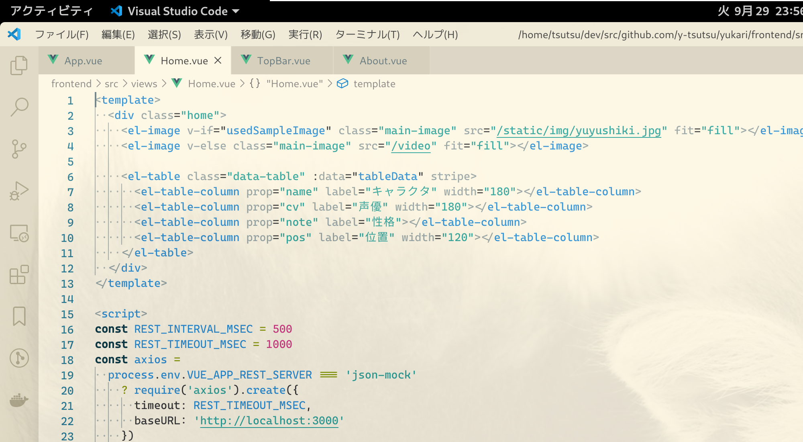
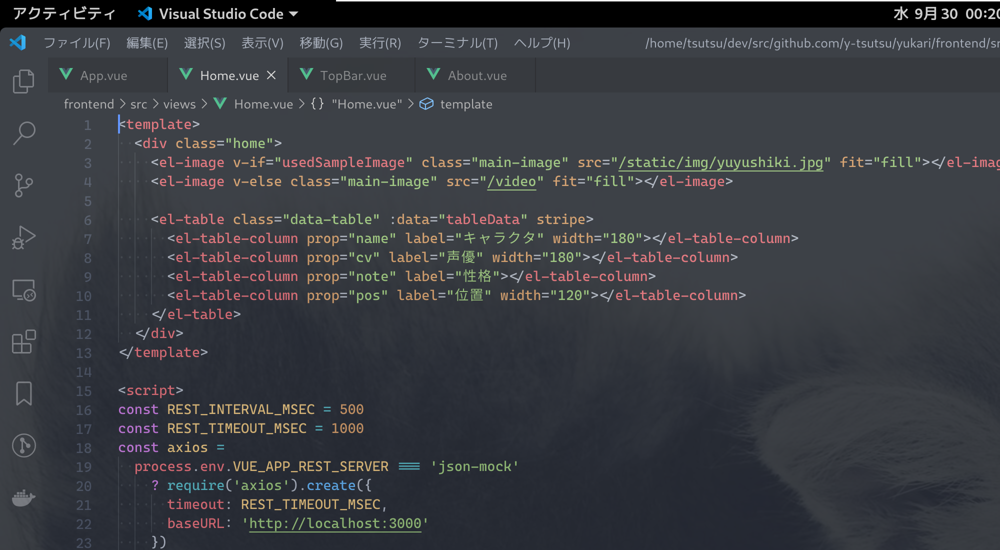
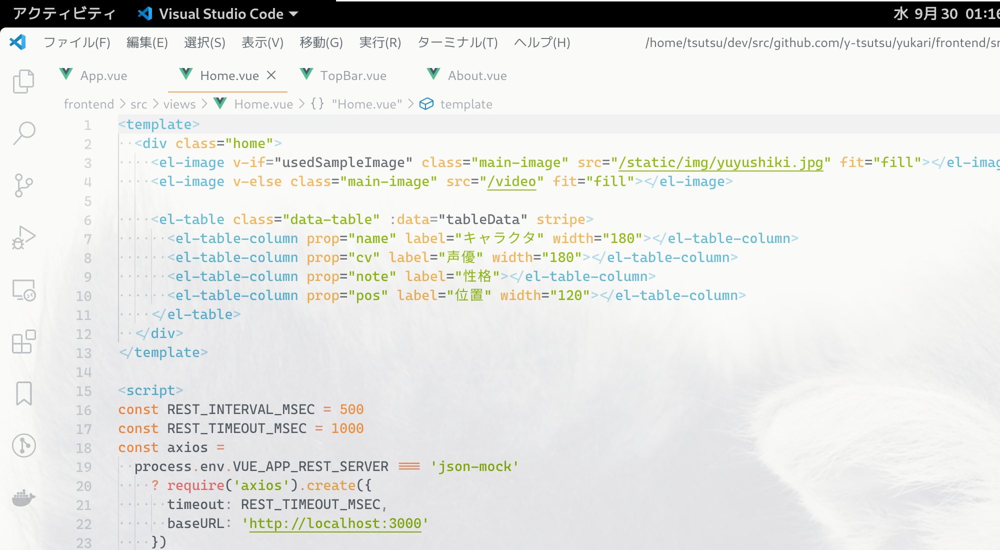

# おすすめカラーテーマ

## Solarized

ダーク・ライトでフォントの色が共通のテーマ．視認性にこだわって作られた有名テーマ．

## Monokai

恋に落ちるエディタ「Sublime Text」のデフォルトテーマ．HTML系がいい感じ．

## Atom One Dark

Atomのデフォルトテーマ．C言語系だと紫・青が印象的なテーマ．

## Dark+

VSCodeのデフォルトのテーマ．無難に見やすくてかっこいい．Sublime TextやAtomにも移植されている．

## Tomorrow

（たぶん）昔からある有名なテーマ．C言語系がいい感じ．バリエーションが多い．紹介しているのはNight．

## Hybrid

Vimでよく紹介されているカラーテーマ．いろいろな言語でバランスがよくて見やすい．

## Material Theme

Google Material Designのカラーを使ったテーマ．アイコンも人気．

## Dracula

派手目で鮮やか．これも結構人気のあるテーマ．自分のWebアプリのシンタックスハイライトに使用している．

## Iceberg Theme

作成者が日本人の青系のクールなテーマ．配色数が少し控えめでクール．

## GitHub Theme

GitHubが出しているカラーテーマ．ライトテーマ以外にダークテーマもある．コードが見やすい．

## Qiita

Qittaのコードブロックのカラーテーマ．

## Slack

Slackっぽい．

## Office Theme

エクセルっぽい．偉い人が見に来たときに仕事してる感を演出できる．ワードやパワポもある．

## Hacker Theme

やばいやつ．

## Ayu

バリエーションは3つでVSCodeはアイコンもセットになっている．自分もコントリビュートしていて真ん中のMirageを使っている．

